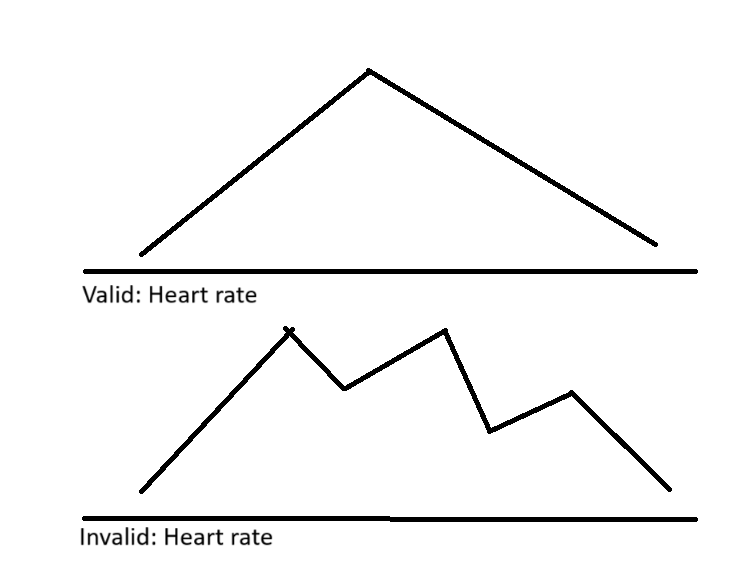

# Heart Rate Validation Checker using Python

Check the provided sample array and return true or false. 

[Read more on Medium][article]

[article][https://medium.com/your-article-link](https://medium.com/@shohagcsediu/heart-rate-validation-problem-solved-59336d44bd3c]

